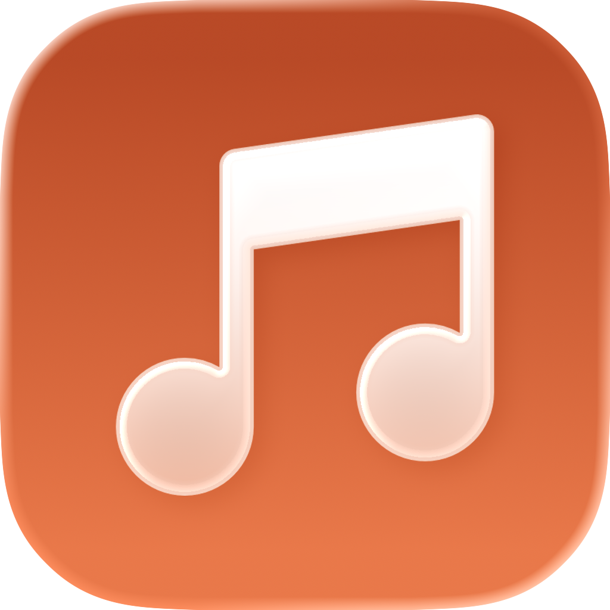
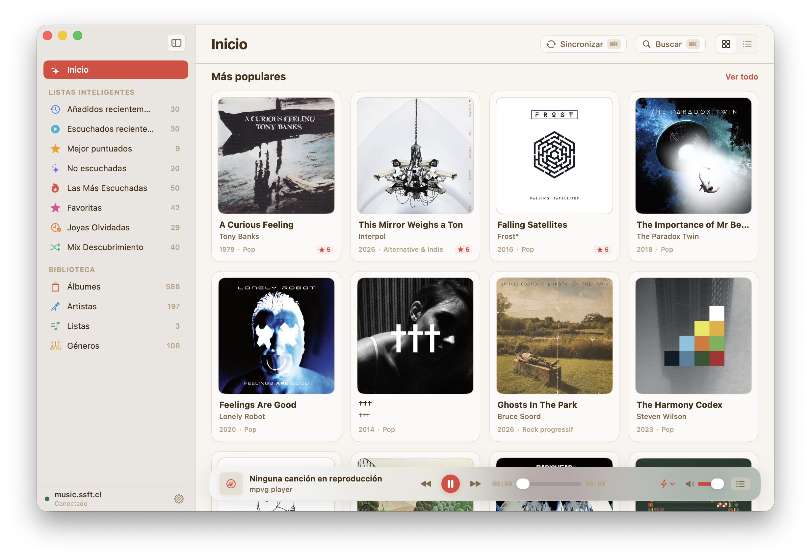
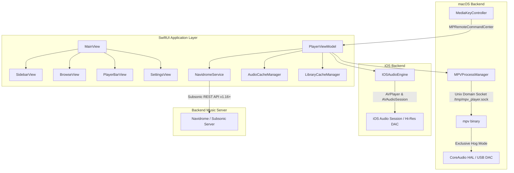

<p align="center">
  
</p>

<h1 align="center">mpvg</h1>

<p align="center">
  <strong>Modern, Audiophile-Grade Subsonic & Navidrome Client for macOS and iOS</strong>
</p>

<p align="center">
  <a href="#features">Features</a> •
  <a href="#architecture">Architecture</a> •
  <a href="#prerequisites">Prerequisites</a> •
  <a href="#getting-started">Getting Started</a> •
  <a href="#audio-engine--exclusive-mode">Audio Engine</a> •
  <a href="#shortcuts">Shortcuts</a> •
  <a href="#localization">Localization</a>
</p>

<p align="center">
  
  
  
  
  
</p>

---

## Overview

**mpvg** is a native, beautifully crafted music player client designed specifically for **Navidrome** and **Subsonic**-compatible media servers. Built from the ground up with **SwiftUI**, it combines a refined, Apple Music-inspired visual design with a high-fidelity audiophile playback engine powered by **mpv** and **CoreAudio** on macOS, and an optimized **AVFoundation** engine on iOS.

Whether you're listening on studio monitors, high-end headphones, or an external USB DAC, mpvg delivers bit-perfect, uncompressed music streaming with zero compromises.

<p align="center">
  
</p>

---

## Features

### 🎧 Audiophile Playback Engine
- **CoreAudio Exclusive Mode (Hog Mode)** *(macOS)*: Takes direct hardware control of your output device (`--audio-exclusive=yes`), bypassing the macOS system mixer and system alert sounds for pure bit-perfect transmission.
- **Dynamic Sample Rate Switching**: Automatically reconfigures your DAC's hardware clock rate to match the incoming audio stream (e.g., 44.1 kHz, 48 kHz, 96 kHz, 192 kHz) without software resampling.
- **Seamless Gapless Playback**: Continuous playback between tracks without audible pauses—essential for classical music, live recordings, and concept albums.
- **Hardware DAC Hotplug Detection**: Real-time CoreAudio listener that detects when USB DACs or headphones are connected or disconnected, automatically warning you if your preferred DAC goes offline.
- **Live Stream Inspector**: Displays active sample rate, bit depth, format (FLAC, ALAC, WAV, MP3, etc.), channels, and exclusive mode status directly in the player bar.

### 🌐 Navidrome & Subsonic Integration
- **Full Library Browsing**: Effortlessly explore your music collection by **Albums**, **Artists**, **Playlists**, and **Genres**.
- **Discovery Sections**: Dedicated views for **Most Popular** and **Recently Added** releases.
- **Instant Search**: Lightning-fast search across tracks, albums, and artists, accessible via header or sidebar with <kbd>⌘</kbd> <kbd>F</kbd>.
- **Bi-directional Star Ratings**: Rate songs directly in the player bar or track lists, synchronizing five-star ratings back to your Navidrome server.
- **Scrobbling & Now Playing**: Notifies your server of active playback and scrobbles completed tracks automatically.

### ⚡ Smart Audio Caching & Preloading
- **Configurable Queue Preload**: Preload up to 10 upcoming tracks into memory and local storage to guarantee instant track changes with zero buffering lag.
- **Disk Audio Cache (`AudioCacheManager`)**: Stores played audio files locally to minimize network bandwidth and prevent playback stutter over unstable connections.
- **Disk Image Cache (`LibraryCacheManager`)**: Ultra-fast asynchronous cover art rendering and persistent disk caching for smooth, jitter-free scrolling.
- **Cache Management**: Transparent cache size monitoring in Settings with one-click cache clearing.

### 🎨 Native, Refined User Experience
- **Liquid Glass Player Bar**: A floating, translucent frosted-glass player bar with real-time seek slider, volume control, time counters, and DAC HUD.
- **Collapsible Sidebar**: Apple Music-style sidebar with translucent vibrant materials, navigation shortcuts, and search.
- **Grid & Table View Modes**: Switch between high-resolution album grid cards and a dense, metadata-rich table view (showing track count, year, genre, and duration).
- **Full Artist & Album Views**: Deep-dive into artist profiles with discographies and top tracks, or inspect complete album tracklists.
- **Interactive Queue Popover**: Inspect, reorder, or jump between upcoming tracks in the playing queue.
- **Toast Notification System**: Subtle, non-intrusive on-screen toasts for audio engine reconnections, DAC events, and server status.

### 🎛️ System Integration
- **Media Keys & Control Center**: Full support for macOS media keys (Play, Pause, Next, Previous, Scrubber) via `MPRemoteCommandCenter` and `MPNowPlayingInfoCenter`.
- **macOS Control Center & iOS Lock Screen**: Displays rich artwork, artist, title, album, and scrubbing bar natively across system controls.
- **Demo Mode**: Includes a sample catalog loader to test and experience the interface without an active server connection.

---

## Architecture

mpvg utilizes a dual-engine architecture tailored to the host platform:



### macOS Engine (`MPVProcessManager`)
- Spawns and manages an independent `mpv` process using IPC over a local Unix domain socket (`/tmp/mpv_player.sock`).
- Automatically locates the Homebrew `mpv` binary (`/opt/homebrew/bin/mpv` or `/usr/local/bin/mpv`).
- Communicates using JSON-IPC commands for millisecond-accurate seeking, volume changes, track transitions, and stream property observation.
- Employs CoreAudio HAL APIs (`kAudioHardwarePropertyDevices`, `kAudioDevicePropertyHogMode`) to monitor audio devices and control DAC hardware formats.

### iOS Engine (`IOSAudioEngine`)
- Utilizes `AVPlayer` and `AVAudioSession` tuned for bit-perfect audio delivery to external USB DACs (such as HiBy FC1 and other Lightning/Type-C dongles).
- Integrates route change notifications and interruption handling for seamless transitions when connecting or disconnecting headphones.

---

## Prerequisites

### For macOS
1. **macOS 14.0 (Sonoma)** or later.
2. **Xcode 15.0+** or **Command Line Tools**.
3. **mpv** installed via [Homebrew](https://brew.sh):
   ```bash
   brew install mpv
   ```

### For iOS
1. **iOS 17.0** or later.
2. Compatible iPhone or iPad with an active network connection to your Subsonic server.

---

## Getting Started

### 1. Clone the Repository
```bash
git clone https://github.com/fabsanh/mpvg.git
cd mpvg
```

### 2. Open in Xcode
Open the Xcode project:
```bash
open mpvg.xcodeproj
```

### 3. Build & Run
- Select the **mpvg (macOS)** or **mpvg (iOS)** scheme.
- Press <kbd>⌘</kbd> <kbd>R</kbd> to build and launch.

### 4. Connect Your Server
1. Navigate to **Settings** in the sidebar.
2. Enter your **Server URL** (e.g., `https://music.yourdomain.com`).
3. Enter your **Username** and **Password** (or API token).
4. Click **Save & Test Connection**.
5. Once connected, your library will automatically synchronize.

---

## Audio Engine & Exclusive Mode

To enable bit-perfect audiophile playback on macOS:

1. Open **Settings** → **Audio Engine & Exclusive Mode**.
2. Select your connected **Output Device** (USB DAC or audio interface).
3. Toggle **CoreAudio Exclusive Mode** to `ON`:
   - mpvg will claim hardware hog mode on the device.
   - macOS alerts and other applications will not mix into your music.
4. Toggle **Bit-Perfect Sample Rate** to `ON`:
   - When playing a 96 kHz or 192 kHz FLAC track, mpvg dynamically changes the physical DAC clock to 96,000 Hz or 192,000 Hz without digital resampling.
5. Toggle **Gapless Playback** to `ON` for uninterrupted playback.

You can also toggle Exclusive Mode directly from the player bar's status badge.

---

## Shortcuts

| Shortcut | Action |
| :--- | :--- |
| <kbd>Space</kbd> | Play / Pause |
| <kbd>⌘</kbd> <kbd>F</kbd> | Focus Search Bar |
| <kbd>Media Play/Pause</kbd> | Play / Pause (System-wide) |
| <kbd>Media Next</kbd> | Next Track (System-wide) |
| <kbd>Media Previous</kbd> | Previous Track (System-wide) |

---

## Localization

mpvg includes complete, native localization support powered by Apple String Catalogs (`Localizable.xcstrings`):
- 🇬🇧 **English** (Default)
- 🇪🇸 **Spanish** (Español)

The application automatically adheres to your system language preference.

---

## License & Credits

Developed by **Fabián Sanhueza** ([@fabsanh](https://github.com/fabsanh)).

Powered by [mpv](https://mpv.io) and built for the [Navidrome](https://www.navidrome.org) / [Subsonic](http://www.subsonic.org) music community.
